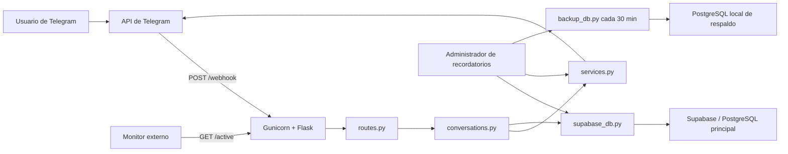

# ARV Reminder Bot v4

Bot de Telegram para crear, consultar, editar y enviar recordatorios. Esta versión
está orientada a ejecutarse continuamente en un VPS de Hostinger mediante Docker.
Usa Supabase como base de datos principal y mantiene una réplica de respaldo en un
PostgreSQL local administrado por Docker Compose.

Este documento describe el comportamiento que realmente implementa el código de
la v4. Debe actualizarse junto con cualquier cambio funcional, de infraestructura
o de base de datos.

## Estado de esta versión

- Versión: `v4`.
- Base: copia limpia de `telegram_reminder_bot_v2`.
- Commit de origen: `7c7a4b84bda54407d0f3ef847d647ce723dd5c97`.
- Fecha del commit base: `2026-05-11`.
- Rama de origen: `main`.
- Repositorio de origen: `https://github.com/AndySiul26/arv_reminder.git`.
- Destino previsto: VPS de Hostinger con Docker y acceso SSH.
- Fuente principal de datos: Supabase.
- Respaldo secundario: PostgreSQL 16 dentro del VPS.

La copia no incluye `.env`, `.git`, `.venv`, bases de datos locales, respaldos ni
archivos de depuración. Las credenciales deben configurarse nuevamente en cada
entorno.

## Funciones disponibles

El bot permite:

- Crear recordatorios mediante una conversación guiada.
- Interpretar fechas y horas escritas en español.
- Guardar las fechas normalizadas en UTC.
- Trabajar con distintas zonas horarias por usuario.
- Consultar recordatorios pendientes o todos los registrados.
- Paginar las listas de cuatro en cuatro.
- Editar recordatorios individualmente.
- Seleccionar varios recordatorios y modificarlos en lote.
- Eliminar recordatorios.
- Crear recordatorios repetibles.
- Repetir por segundos, minutos, horas, días, semanas, meses o años.
- Enviar avisos normales una sola vez.
- Enviar avisos constantes cada minuto hasta que el usuario los detenga.
- Aplazar avisos normales o constantes 5, 10, 20 minutos o por una duración
  personalizada.
- Buscar recordatorios por nombre, descripción o ID.
- Consultar y editar desde una única lista interactiva.
- Recibir reportes de problemas y avisar al administrador.
- Distribuir notas de actualización a los usuarios.
- Activar un modo tester/mantenimiento limitado a un chat autorizado.
- Entrar en modo de mantenimiento si Supabase no está disponible al arrancar.
- Replicar periódicamente los datos de Supabase a PostgreSQL.
- Exponer rutas HTTP de estado para monitoreo.

## Arquitectura



### Componentes en producción

Docker Compose levanta dos servicios:

1. `arv_reminder_bot`
   - Aplicación Python 3.10.
   - Flask expone las rutas HTTP.
   - Gunicorn escucha en `0.0.0.0:8443`.
   - Utiliza un proceso y ocho hilos.
   - Configura el webhook de Telegram al arrancar.
   - Ejecuta el administrador de recordatorios en un hilo daemon.

2. `postgres_backup`
   - PostgreSQL 16 Alpine.
   - Guarda la réplica de respaldo.
   - Usa el volumen persistente `pg_backup_data`.
   - Inicializa el esquema con `init_backup_db.sql`.

Supabase no corre dentro del VPS. Es un servicio externo y constituye la fuente
de verdad de la aplicación.

## Arranque de la aplicación

En producción, el flujo de arranque es:

1. Docker Compose inicia `postgres_backup`.
2. El healthcheck espera hasta que PostgreSQL acepte conexiones.
3. Se construye e inicia `arv_reminder_bot`.
4. `entrypoint.sh` ejecuta `setup_supabase.py`.
5. Se genera un certificado SSL autofirmado si no existe.
6. El certificado se registra junto con `WEBHOOK_URL` mediante `setWebhook` de
   Telegram.
7. Gunicorn inicia Flask en el puerto `8443`.
8. Al importar `app.py`, se valida la conexión real con Supabase leyendo
   `modo_tester`.
9. Si Supabase responde, comienza el administrador de recordatorios.
10. Si Supabase no responde, Flask permanece activo en modo mantenimiento.

La aplicación usa un solo proceso de Gunicorn porque parte del estado conversacional
vive en un diccionario global en memoria. Aumentar el número de procesos sin
rediseñar esa parte puede repartir una conversación entre memorias distintas.

## Flujo de Telegram

Telegram envía cada actualización al endpoint `POST /webhook`.

`routes.py` clasifica la actualización:

- `message`: mensaje o comando escrito.
- `callback_query`: pulsación de un botón inline.

Los mensajes pasan a `procesar_mensaje()` y los botones a
`procesar_callback()` en `conversations.py`. Este módulo implementa una máquina
de estados por `chat_id`.

Las respuestas se envían directamente a la API HTTP de Telegram desde
`services.py`. No se utiliza polling en producción.

### Comandos

| Comando | Función |
| --- | --- |
| `/start` | Muestra la bienvenida y botones iniciales. |
| `/ayuda` | Muestra la lista de comandos. |
| `/recordatorio` | Inicia la creación de un recordatorio. |
| `/recordatorios` | Abre el gestor para buscar, consultar y editar. |
| `/buscar` | Busca por nombre, descripción o ID. |
| `/pendientes` | Alias compatible que abre el gestor filtrado por pendientes. |
| `/editar` | Alias compatible que abre el gestor principal. |
| `/reportar` | Inicia el registro de una incidencia. |
| `/cancelar` | Cancela el flujo conversacional actual. |
| `parar`, `detener` o `alto` | Detiene todos los avisos constantes ya activados del chat. |

También se aceptan algunas variantes sin `/`, como `recordatorio`, `editar`,
`pendiente`, `recordatorios`, `buscar` y `reportar`. El menú visible de Telegram
solo publica los comandos principales; los alias permanecen para no romper usos
anteriores.

### Creación de un recordatorio

El flujo de `/recordatorio` solicita:

1. Nombre de la tarea.
2. Descripción.
3. Zona horaria, si el chat aún no tiene una registrada.
4. Fecha y hora local.
5. Si debe repetirse.
6. Intervalo de repetición, cuando corresponda.
7. Si debe usar aviso constante.
8. Confirmación final.

La fecha se interpreta con `dateparser` en español. Debe ser posterior al momento
actual. La hora ingresada se considera perteneciente a la zona horaria del usuario
y se convierte a UTC antes de guardarse.

La zona horaria queda asociada al chat en `chats_info`. Las zonas disponibles en
esta versión son:

- Ciudad de México.
- Buenos Aires.
- Bogotá.
- Lima.
- Santiago.
- Caracas.
- Madrid.
- Londres.
- Tokio.
- Nueva Delhi.

### Intervalos de repetición

Se acepta `n:unidad` o `nunidad`; por ejemplo, `2:h` y `2h` equivalen a cada dos
horas.

| Símbolo | Unidad |
| --- | --- |
| `s` | segundos |
| `x` | minutos |
| `h` | horas |
| `d` | días |
| `w` | semanas |
| `m` | meses |
| `a` | años |

Cuando vence un recordatorio repetible:

1. Se envía el recordatorio actual.
2. El registro actual se marca como notificado.
3. Se calcula la próxima fecha.
4. Se crea un nuevo registro con la próxima fecha.
5. El registro anterior se marca con `repeticion_creada = true`.

Meses y años se calculan con `relativedelta`; el resto utiliza `timedelta`.

### Aviso normal y aviso constante

Un aviso normal se envía una sola vez y después queda con `notificado = true`.

Un aviso constante cumple estas condiciones:

- `aviso_constante = true`.
- `aviso_detenido = false`.
- La fecha ya venció.

Aunque el registro ya esté marcado como notificado, vuelve a entrar en la consulta
de pendientes y se envía aproximadamente una vez por minuto. Cada mensaje incluye
un botón `Detener`.

En la implementación actual, `parar`, `detener`, `alto` o el botón `Detener`
marcan como detenidos todos los avisos constantes notificados del mismo `chat_id`,
no únicamente el recordatorio cuyo botón fue pulsado. Los mensajes conservados en
el estado del chat se editan para indicar que fueron detenidos.

### Aplazamiento

Todos los avisos, normales y constantes, incluyen botones para:

- Aplazar 5 minutos.
- Aplazar 10 minutos.
- Aplazar 20 minutos.
- Elegir una duración personalizada.

La duración personalizada acepta un número solo —interpretado como minutos— o
expresiones como `45 minutos`, `2 horas` y `1 día`. El máximo es de 30 días.

El callback incluye el ID del recordatorio y la operación valida que ese registro
pertenezca al mismo `chat_id`. Al aplazar:

1. Se calcula la nueva fecha desde el momento de la acción.
2. Se guarda en UTC.
3. Se establece `notificado = false`.
4. Se establece `aviso_detenido = false`.
5. Se conserva `repeticion_creada` para no duplicar la siguiente ocurrencia de
   una serie.
6. El mensaje original se edita y se retiran sus botones.

En un aviso constante, la nueva fecha impide los reenvíos hasta que vuelva a
vencer.

### Gestor unificado: consulta, búsqueda y edición

`/recordatorios` abre una sola interfaz con filtros para pendientes o todos,
búsqueda, consulta de detalles, edición individual y selección múltiple.
`/buscar` abre directamente la captura del término de búsqueda.

Las listas:

- Se ordenan por `fecha_hora` ascendente desde Supabase.
- Muestran cuatro entradas seleccionables por página.
- Permiten buscar por nombre, descripción o ID.
- Indican fecha y si el registro está pendiente o notificado.
- Se navegan con botones Anterior y Siguiente.
- Abren una ficha completa al seleccionar un resultado.
- Permiten pasar de la ficha al editor.
- Conservan la selección múltiple para operaciones en lote.
- Se cierran eliminando el mensaje interactivo.

### Edición individual

La edición individual se abre desde la ficha de un resultado del gestor
unificado. `/editar` se conserva como alias y abre la misma interfaz.

En edición individual se puede:

- Ver todos los detalles.
- Cambiar el nombre.
- Cambiar la descripción.
- Cambiar fecha y hora.
- Activar o desactivar repetición.
- Cambiar el intervalo.
- Activar o desactivar aviso constante.
- Eliminar el recordatorio.

Al cambiar la fecha, el registro vuelve a `notificado = false` y
`aviso_detenido = false`.

### Edición por lotes

La selección múltiple permite:

- Eliminar varios recordatorios.
- Activar repetición y asignar el mismo intervalo.
- Desactivar repetición.
- Cambiar el intervalo de los que ya son repetibles.

La cuadrícula muestra cuatro elementos por página y permite mantener selecciones
entre páginas. Las operaciones se aplican una fila a la vez en Supabase.

### Reportes

`/reportar` solicita una descripción del problema. El reporte se guarda en la
tabla `reportes` con estado `pendiente`.

Si existe `TELEGRAM_TEST_USER_ID`, el mismo texto también se envía por Telegram a
ese chat para avisar al administrador.

### Notas de actualización

Las notas se redactan en `Actualizaciones.txt` usando bloques separados por `---`.
Cada bloque contiene un título y una descripción.

`gestionar_actualizaciones.py` permite:

- Insertar las notas en `actualizaciones_info`.
- Registrar chats que todavía no aparecen en
  `chats_avisados_actualizaciones`.
- Consultar quién no ha recibido la última actualización.
- Eliminar una actualización.

El administrador interno revisa cada cinco minutos la última actualización. La
envía a los chats pendientes y guarda el último ID recibido por cada chat.

`enviar_actualizacion_manual.py` ejecuta de una vez la inserción, sincronización y
envío. Debe usarse con cuidado para no insertar dos veces el mismo contenido.

## Procesos programados

El administrador usa la librería `schedule` dentro de un hilo daemon.

| Frecuencia | Acción |
| --- | --- |
| Al arrancar | Corrige o solicita zonas horarias y revisa recordatorios vencidos. |
| Cada 1 minuto | Consulta y envía recordatorios. |
| Cada 1 minuto, temporalmente | Reintenta solicitar zonas faltantes hasta completar la migración. |
| Cada 5 minutos | Revisa y distribuye notas de actualización. |
| Cada 30 minutos | Replica Supabase hacia PostgreSQL local. |
| Al revisar actualizaciones | Programa un ping diferido a `URL_MONITOR`, si está configurada. |

El bucle del scheduler despierta cada segundo para ejecutar trabajos pendientes.

## Datos y persistencia

### Supabase

Supabase es la única fuente utilizada por las funciones normales de creación,
consulta, edición y envío.

| Tabla | Propósito |
| --- | --- |
| `recordatorios` | Tareas, fechas y estado de notificación. |
| `chats_info` | Nombre, tipo y zona horaria de cada chat. |
| `chats_id_estados` | Estado conversacional persistente y metadatos auxiliares. |
| `reportes` | Incidencias enviadas por usuarios. |
| `actualizaciones_info` | Historial de notas de actualización. |
| `chats_avisados_actualizaciones` | Última actualización recibida por cada chat. |
| `modo_tester` | Interruptor global del modo tester. |

#### Campos principales de `recordatorios`

| Campo | Uso |
| --- | --- |
| `id` | Identificador del recordatorio. |
| `chat_id` | Propietario/destinatario de Telegram. |
| `usuario` | Nombre recibido desde Telegram. |
| `nombre_tarea` | Título de la tarea. |
| `descripcion` | Detalle de la tarea. |
| `fecha_hora` | Fecha programada, normalmente en UTC ISO 8601. |
| `creado_en` | Fecha de creación. |
| `notificado` | Indica si el aviso normal ya fue enviado. |
| `es_formato_utc` | Indica si la fecha fue normalizada. |
| `aviso_constante` | Habilita reenvíos periódicos. |
| `aviso_detenido` | Detiene esos reenvíos. |
| `repetir` | Habilita la creación del siguiente recordatorio. |
| `intervalo_repeticion` | Símbolo de la unidad. |
| `intervalos` | Cantidad de unidades. |
| `repeticion_creada` | Evita crear dos veces la siguiente ocurrencia. |

#### Estado conversacional

`conversations.py` mantiene un diccionario en memoria por `chat_id`. Para poder
continuar algunos flujos después de reinicios, guarda información en
`chats_id_estados`:

- `estado_1`: última solicitud de zona horaria.
- `estado_2`: estado actual de la máquina conversacional.
- `estado_3`: datos JSON del flujo.
- `estado_4`: mensajes de avisos constantes que pueden editarse al detenerse.
- `estado_5`: reservado.

Los datos serializados deben contener únicamente tipos compatibles con JSON.
Listas, cadenas, números, booleanos y diccionarios son válidos; `set`, `datetime`
u objetos de librerías no deben guardarse directamente.

### PostgreSQL de respaldo

Cada treinta minutos, `backup_db.py`:

1. Descarga cada tabla configurada desde Supabase.
2. Consulta qué columnas existen también en el PostgreSQL local.
3. Vacía la tabla destino con `TRUNCATE ... CASCADE`.
4. Inserta la copia completa.
5. Usa un `SAVEPOINT` por fila para aislar datos incompatibles.
6. Registra cantidad y hora en `_backup_metadata`.

Se respaldan:

- `recordatorios`.
- `chats_info`.
- `chats_id_estados`.
- `actualizaciones_info`.
- `chats_avisados_actualizaciones`.
- `reportes`.

`modo_tester` no forma parte del respaldo actual. Este PostgreSQL tampoco se usa
automáticamente como origen alternativo si Supabase cae; es una réplica para
recuperación manual.

## Modo tester y modo mantenimiento

### Modo tester

El valor se guarda en la tabla `modo_tester`. Cuando está activo:

- Solo `TELEGRAM_TEST_USER_ID` puede usar normalmente el bot.
- Otros chats reciben un mensaje de mantenimiento.
- Las notas de actualización se envían únicamente al tester.
- Las solicitudes de corrección de zona se limitan al tester.

### Modo mantenimiento por caída de Supabase

Durante el arranque se intenta leer `modo_tester`. Si falla:

- Flask y las rutas HTTP siguen disponibles.
- No se inicia el administrador de recordatorios.
- `/start` y `/ayuda` pueden pasar por el flujo básico.
- Los demás mensajes reciben una respuesta de servicio en mantenimiento.
- Los callbacks reciben una respuesta de mantenimiento.

Actualmente no existe un trabajo que reactive automáticamente el administrador
cuando Supabase vuelve. Es necesario reiniciar el contenedor.

## Endpoints HTTP

| Método | Ruta | Función |
| --- | --- | --- |
| `GET` | `/` | Devuelve `Bot ARV Reminder activo`. |
| `GET` | `/active` | Confirma actividad y programa un ping a `URL_MONITOR`. |
| `POST` | `/webhook` | Recibe actualizaciones de Telegram. |

No existe autenticación adicional en `/webhook`; la protección depende de que la
URL no sea utilizada por terceros. La versión actual tampoco configura un secret
token de webhook de Telegram.

## Variables de entorno

Crear `.env` a partir de `.env.example`. Nunca subir `.env` al repositorio.

| Variable | Requerida | Uso |
| --- | --- | --- |
| `TELEGRAM_TOKEN` | Sí | Token del bot; envío de mensajes y registro del webhook en producción. |
| `SUPABASE_URL` | Sí | URL del proyecto de Supabase. |
| `SUPABASE_KEY` | Sí | Clave usada por la aplicación normal. |
| `SUPABASE_KEY_SERVICE_ROLE` | Sí para instalación/admin | Creación de tablas y scripts administrativos. |
| `TELEGRAM_TEST_USER_ID` | Recomendable | Chat autorizado en modo tester y receptor de reportes. |
| `WEBHOOK_URL` | Sí en producción | URL HTTPS completa terminada en `/webhook`. |
| `LOCAL_MODE` | Sí | `false` en producción; habilita el servidor local si es `true`. |
| `USE_NGROK_LOCAL` | Solo local | Registra un túnel ngrok al ejecutar localmente. |
| `TZ` | Recomendable | Zona horaria del contenedor. |
| `ZONA_SERVIDOR` | Recomendable | Zona usada para convertir la hora del servidor a UTC. |
| `URL_MONITOR` | No | URL externa que recibe pings diferidos. |
| `BACKUP_PG_HOST` | Docker la define | Host del PostgreSQL de respaldo. |
| `BACKUP_PG_PORT` | Docker la define | Puerto del respaldo. |
| `BACKUP_PG_DB` | Docker la define | Base de datos del respaldo. |
| `BACKUP_PG_USER` | Docker la define | Usuario del respaldo. |
| `BACKUP_PG_PASS` | Muy recomendable | Contraseña del respaldo. |

Hay una inconsistencia heredada: `webhook_utils.py` busca
`TELEGRAM_BOT_TOKEN`, mientras el resto del sistema usa `TELEGRAM_TOKEN`.
El arranque Docker no depende de esa variable antigua porque `entrypoint.sh`
registra el webhook directamente con `TELEGRAM_TOKEN`. Las herramientas locales
basadas en `webhook_utils.py` sí pueden requerir corregir esa diferencia.

## Instalación en un VPS de Hostinger

### Requisitos

- VPS Linux con acceso SSH.
- Docker Engine.
- Docker Compose v2.
- Dominio apuntando al VPS.
- Puerto público compatible con el webhook.
- Bot creado con BotFather.
- Proyecto Supabase configurado.

### Preparación

```bash
git clone <repositorio-v4>
cd telegram_reminder_bot_v4
cp .env.example .env
nano .env
```

Definir una contraseña fuerte para el PostgreSQL local:

```dotenv
BACKUP_PG_PASS=una_contraseña_larga_y_unica
```

### Inicio

```bash
docker compose up -d --build
docker compose ps
docker logs -f arv_reminder_bot
```

El Compose actual publica `8443:8443`, Gunicorn sirve HTTPS directamente en
`8443` y `WEBHOOK_URL` está sobrescrita en `docker-compose.yml` con el dominio de
producción heredado.

Antes de desplegar la v4 debe decidirse una sola topología:

1. HTTPS directo en `8443` con certificado autofirmado registrado en Telegram;
   esta es la configuración que implementan actualmente Compose y
   `entrypoint.sh`.
2. EasyPanel o Nginx terminando TLS en `443` y enviando tráfico HTTP interno al
   contenedor; esto requiere ajustar Compose y retirar o adaptar el SSL interno.

La guía heredada `DEPLOY.md` menciona el puerto `5500`, pero el código ejecutable
actual usa `8443`. No deben mezclarse ambas configuraciones.

### Actualización

```bash
cd <directorio-del-proyecto>
git pull origin main
docker compose up -d --build
docker compose ps
docker logs --tail 100 arv_reminder_bot
```

Si solo cambió `.env`, recrear el contenedor:

```bash
docker compose up -d --force-recreate
```

### Verificación

```bash
curl -k https://127.0.0.1:8443/
docker compose ps
docker logs --tail 200 arv_reminder_bot
docker logs --tail 100 arv_postgres_backup
```

Después:

1. Consultar la URL pública.
2. Revisar `getWebhookInfo` en Telegram.
3. Enviar `/start`.
4. Crear un recordatorio de prueba para algunos minutos después.
5. Confirmar que el mensaje llegue.
6. Revisar `_backup_metadata` después del siguiente ciclo de respaldo.

## Ejecución local

Instalar Python 3.10 o compatible:

```bash
python -m venv .venv
```

En Windows:

```powershell
.\.venv\Scripts\Activate.ps1
pip install -r requirements.txt
```

En Linux:

```bash
source .venv/bin/activate
pip install -r requirements.txt
```

Configurar `.env`, activar `LOCAL_MODE=true` y, si se desea,
`USE_NGROK_LOCAL=true`.

Existe un detalle heredado: `app.py` calcula `LOCAL_MODE` antes de ejecutar
`load_dotenv()`. Por ello, definirlo solamente dentro de `.env` puede no iniciar
el servidor local. Hasta corregir el orden, exportar la variable antes de ejecutar:

```powershell
$env:LOCAL_MODE = "true"
python app.py
```

Además, la ruta local de registro de webhook usa `webhook_utils.py` y la variable
heredada `TELEGRAM_BOT_TOKEN`.

## Archivos principales

### Núcleo activo

| Archivo | Responsabilidad |
| --- | --- |
| `app.py` | Crea Flask, valida Supabase y controla el administrador. |
| `routes.py` | Endpoints HTTP y enrutamiento de mensajes/callbacks. |
| `conversations.py` | Máquina de estados y lógica funcional del usuario. |
| `reminders.py` | Scheduler, envíos vencidos, repeticiones y actualizaciones. |
| `supabase_db.py` | Acceso centralizado a Supabase y reintentos. |
| `services.py` | Cliente HTTP de Telegram y edición de mensajes. |
| `utilidades.py` | Fechas, zonas horarias, intervalos y ngrok. |
| `plantillas.py` | Textos reutilizables de algunos flujos de edición. |
| `gestionar_actualizaciones.py` | CRUD y seguimiento de notas de versión. |
| `backup_db.py` | Réplica Supabase → PostgreSQL local. |

### Infraestructura

| Archivo | Responsabilidad |
| --- | --- |
| `Dockerfile` | Imagen Python del bot. |
| `docker-compose.yml` | Bot, PostgreSQL de respaldo, red y variables. |
| `entrypoint.sh` | Supabase, certificado, webhook y Gunicorn. |
| `init_backup_db.sql` | Esquema del PostgreSQL de respaldo. |
| `setup_supabase.py` | Creación/actualización de tablas mediante `exec_sql`. |
| `enable_rls.sql` | Habilitación de RLS y políticas actuales. |
| `.env.example` | Plantilla de configuración sin secretos. |

### Herramientas y legado

| Archivo | Estado |
| --- | --- |
| `enviar_actualizacion_manual.py` | Herramienta administrativa vigente. |
| `clean_duplicates.py` | Limpieza manual de duplicados. |
| `fix_zombies.py` | Corrección manual heredada. |
| `database_manager.py` | Capa SQLite heredada; no participa en el flujo normal. |
| `importar_datos.py` | Migración histórica desde la base local. |
| `start.sh`, `glitch.json`, `runtime.txt` | Despliegue histórico en Glitch. |
| `webhook_utils.py` | Utilidad manual/local con nombre de token heredado. |
| `Deploy Telegram Bot Docker.md` | Registro histórico extenso, no manual vigente. |
| `GEMINI.md` | Manual anterior; contiene afirmaciones desactualizadas. |

## Seguridad actual

- `.env` está ignorado por Git y excluido de la imagen durante el build.
- El token de Telegram y las claves de Supabase deben existir únicamente en
  variables de entorno.
- `SUPABASE_KEY_SERVICE_ROLE` concede privilegios elevados y solo debe utilizarse
  para administración y creación de tablas.
- `enable_rls.sql` habilita RLS, pero sus políticas conceden acceso total al rol
  `anon`. Por lo tanto, no existe aislamiento real por fila en la configuración
  actual.
- El ID del chat que recibe alertas de base de datos está escrito directamente en
  `supabase_db.py`; debe convertirse en variable de entorno.
- El valor predeterminado de `BACKUP_PG_PASS` no es seguro para producción.
- Los JSON de actualizaciones entrantes se agregan a `debug_mensaje.json` y
  `debug_callback.json`. Pueden contener nombres, IDs y mensajes de usuarios.
- El webhook no valida `X-Telegram-Bot-Api-Secret-Token`.
- El certificado es autofirmado y se vuelve a generar al reconstruir una imagen
  que no conserve esos archivos.

No se deben publicar registros, respaldos ni archivos de depuración.

## Limitaciones y deuda técnica de la base v2

Estas observaciones continúan vigentes después de esta actualización:

1. `DEPLOY.md` describe `5500`, mientras Compose y Gunicorn usan `8443`.
2. El dominio de producción está escrito directamente en `docker-compose.yml`.
3. `LOCAL_MODE` se lee antes de `load_dotenv()`.
4. `webhook_utils.py` usa `TELEGRAM_BOT_TOKEN`, pero producción usa
   `TELEGRAM_TOKEN`.
5. Detener un aviso constante detiene todos los avisos constantes notificados del
   chat.
6. PostgreSQL es solo respaldo; no existe failover automático.
7. Si Supabase falla al arrancar, el administrador no se recupera sin reinicio.
8. Las políticas RLS permiten acceso completo al rol `anon`.
9. El estado global en memoria limita el escalado a varios procesos/instancias.
10. Los callbacks y el diccionario global no tienen bloqueo explícito entre los
    ocho hilos de Gunicorn.
11. `setup_supabase.py` depende de una función RPC `exec_sql` ya disponible; no
    puede crearla por sí mismo.
12. El respaldo no incluye `modo_tester`.
13. La suite automatizada cubre las funciones nuevas, pero no todos los flujos
    conversacionales históricos.
14. Algunas herramientas SQLite permanecen en el repositorio aunque ya no forman
    parte del runtime.
15. Los archivos `debug_*.json` crecen sin rotación mientras el contenedor vive.
16. Algunas llamadas HTTP de Telegram no declaran timeout explícito.
17. El chat administrador para errores de base de datos está hardcodeado.

## Regla de mantenimiento de la v4

Cada cambio debe incluir, según corresponda:

1. Código.
2. Pruebas o procedimiento de verificación.
3. Cambio de esquema o migración.
4. Actualización de `.env.example`.
5. Actualización de Docker/infraestructura.
6. Actualización de este README.
7. Nota de versión para los usuarios si cambia el comportamiento visible.

Antes de desplegar:

```bash
python -m compileall .
docker compose config
docker compose build
```

También se debe probar manualmente:

- `/start` y `/ayuda`.
- Creación normal.
- Creación repetible.
- Aplazamiento de 5, 10 y 20 minutos.
- Aplazamiento personalizado en minutos, horas y días.
- Aviso constante, aplazamiento y detención.
- `/recordatorios`, filtros y paginación.
- `/buscar` por nombre, descripción e ID.
- Apertura de detalle y paso a edición.
- Edición individual.
- Edición múltiple.
- `/reportar`.
- Modo tester.
- Reinicio del contenedor durante una conversación.
- Envío de una nota de actualización.
- Ejecución y restauración de un respaldo.

## Principio de diseño

La v4 parte de una regla central: **Supabase es la fuente de verdad; PostgreSQL
local es una réplica de recuperación**. Ningún cambio futuro debe reintroducir
escrituras bidireccionales o sincronización automática desde el respaldo sin un
diseño explícito de resolución de conflictos.
